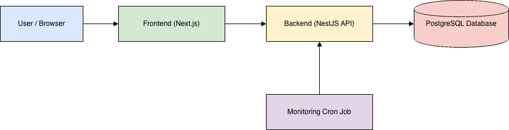
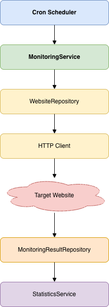
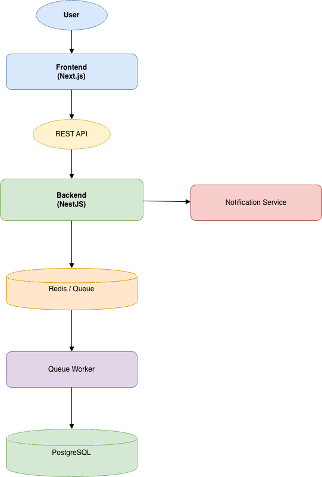

# System Design

## Introduction

This document describes the high-level architecture of PulseWatch.

Its purpose is to explain how the system is organized, how major components communicate, and how responsibilities are separated.

Detailed implementation and business logic are intentionally excluded from this document.

---

# Architecture Overview

PulseWatch follows a modular client-server architecture.

The system consists of three independent repositories:

- Frontend
- Backend
- Documentation

The frontend communicates with the backend through a REST API, while the backend manages business logic, monitoring processes, and data persistence.

---

# High-Level Architecture

## 

# Main Components

## Frontend

Responsibilities:

- User Interface
- Authentication
- Dashboard
- Website Management
- Statistics Visualization
- API Communication

The frontend contains no business logic.

All operations are performed through the backend API.

---

## Backend

The backend is responsible for all business logic.

Responsibilities include:

- Authentication
- Website Management
- Monitoring Engine
- SSL Inspection
- Statistics Calculation
- REST API
- Background Jobs
- Data Persistence

The backend follows a modular architecture where each domain is isolated into its own module.

---

## Database

The database stores all persistent data.

Examples include:

- Users
- Websites
- Monitoring Results
- SSL Information

The database acts as the single source of truth for the application.

---

# Backend Modules

The backend is divided into multiple feature modules.

## Auth Module

Responsible for:

- Registration
- Login
- JWT Authentication
- Authorization

---

## Website Module

Responsible for:

- Website CRUD
- Website configuration
- Monitoring settings

---

## Monitoring Module

Responsible for:

- Manual website checks
- Scheduled monitoring
- HTTP requests
- Recording monitoring results

---

## SSL Module

Responsible for:

- Reading SSL certificates
- Detecting expiration dates
- SSL validation

---

## Statistics Module

Responsible for:

- Uptime calculation
- Response time aggregation
- Historical statistics
- Dashboard metrics

---

# Monitoring Flow

Website monitoring is executed automatically using scheduled background jobs.

General workflow:

The monitoring service operates independently from user requests.

---

# Security Design

Authentication is performed using JWT.

Protected endpoints require a valid access token.

Input validation is performed before business logic is executed.

Sensitive operations require authenticated users.

---

# Error Handling

Errors are handled centrally.

The system returns consistent error responses for:

- Validation errors
- Authentication failures
- Resource not found
- Internal server errors

---

# Background Jobs

Monitoring operations are executed outside the normal request lifecycle.

Responsibilities include:

- Periodic website monitoring
- SSL certificate inspection
- Statistics updates

Future versions may replace the scheduler with a queue-based architecture.

---

# Scalability

The architecture is designed to support future expansion.

Potential future improvements include:

- Redis
- Queue Workers
- Distributed Monitoring
- Notification Services
- Public Status Pages

These additions can be integrated without major architectural changes.

---

# Design Principles

PulseWatch follows several software engineering principles.

- Separation of Concerns
- Single Responsibility Principle
- Modular Architecture
- Clean Code
- Reusability
- Maintainability
- Scalability

---

# Future Architecture

Future versions may introduce additional infrastructure components.

Example:

The initial implementation intentionally keeps the architecture simple while allowing future expansion.

---

# Related Documentation

- [01-project-overview.md](./01-project-overview.md)
- [02-requirements.md](./02-requirements.md)
- [04-database-design.md](./04-database-design.md)
- [05-api.md](./05-api.md)
- [06-roadmap.md](./06-roadmap.md)
- [07-deployment.md](./07-deployment.md)
